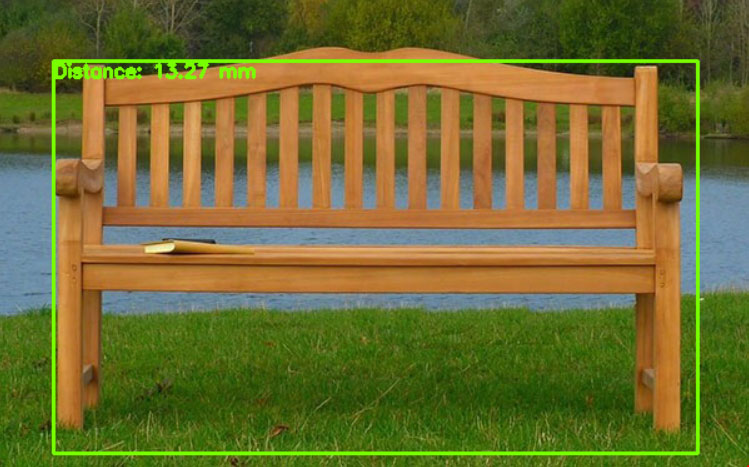
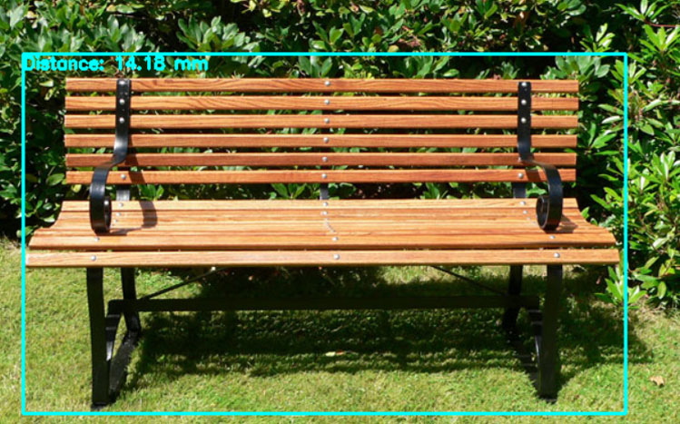
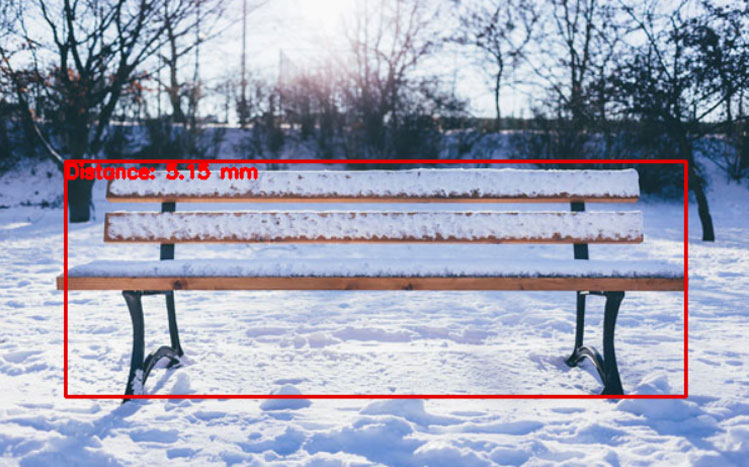

# Real-Time Object Detection Using Yolov2 and Distance Estimation

This project repository provides a means that can be used to find the distance of an object or an indication of how close the object is, to the camera lens.
The codes present in this perfume are simply attempts to scan deep concepts for calculating the distance of objects from camera lenses.

## Real-Time Object Detection and Distance Estimation GUI

<table>
  <tbody align="center">
	<tr align="center"> 
		<th><strong>Object Detection Distance Estimation Bench 1</strong></th>
	</tr>
	<tr align="center">
		<td></td>		
	</tr>
	<tr align="center"> 
		<th><strong>Object Detection Distance Estimation Bench 2</strong></th>
	</tr>
	<tr align="center">
		<td></td>		
	</tr>
	<tr align="center"> 
		<th><strong>Object Detection Distance Estimation Bench 3</strong></th>
	</tr>
	<tr align="center">
		<td></td>		
	</tr>
	<tr align="center"> 
		<th><strong>Object Detection Distance Estimation Bench 4</strong></th>
	</tr>
	<tr align="center">
		<td></td>		
	</tr>
</tbody>
</table>
